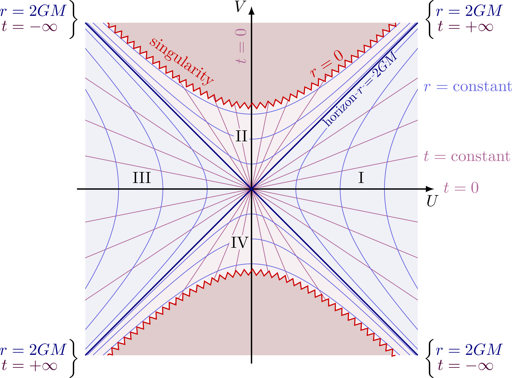

# Schwarzschild Black Hole Simulation

> Made using [__Groot Engine__](https://github.com/hippmatthew/groot-engine)

### Installation

0. Install [__Groot Engine__](https://github.com/hippmatthew/groot-engine) and it's requirements
1. Clone this repository
2. Navigate to the root of the repository
3. Create a build folder with `mkdir build`
4. Navigate to the build directory with `cd build`
5. Build the CMake files with `cmake ..`. Be sure to add on any needed CMake options.
6. Compile the project with `make`
7. Run the project with `./simulate`

### Background Knowledge

> This section and the following section are going to have some mathematics in them. I cannot put detailed descriptions of everything covered in an introductory course on relativity, so if you are unfamiliar with the math and want to read through these sections out of interest in the history and mathematical formalism of black holes, I recommend taking my equations as they are and not trying to dig too deep as to where they came from or what each symbol means. For example, if you dont know what an interval or a metric is, just take what I write down to be the interval (or the metric) and leave it at that.

Einstein published his theory of general relativity in 1915. It is a theory built upon an addition to the Galilean relativistic principles: the existance of a maximum signal speed between two events (the speed of light). With this, time became a coordinate in a four dimensional spacetime that is curved by the matter that exists inside of it. The core of this, are Einsteins field equations:

$$ R_{\mu\nu} - \dfrac{1}{2}Rg_{\mu\nu} + \Lambda g_{\mu\nu} = 8\pi T_{\mu\nu} $$

> Note that I am using natural units ($G = c = 1$)

Einstein believed that his equations were unsolvable. However, not long after his paper had been published he recieved a letter from Karl Schwarzschild containing a solution that describes the spacetime around a spherical, non-rotating mass. This solution is the well-known Schwarzschild metric, denoted by the interval:

$$ ds^2 = -(1 - \dfrac{r_s}{r})dt^2 + (1 - \dfrac{r_s}{r})^{-1}dr^2 + r^2d\theta^2 + r^2\sin^2\theta d\phi^2 $$

$r_s$ is called the Schwarzschild radius, and it denotes the radius of the black hole's event horizon, the point at which spacetime flows into $r=0$, the black hole's singularity, faster than the speed of light -- meaning that nothing can escape its pull.

The problem that plagued physicists were the two singular values of $r$: $r = r_s$ and $r = 0$. Both of these values resulted in a term blowing up to infinity, which in physics is deemed as a breakdown in the theory as infinities are seen as unphysical.

Upon further analysis of the Schwarzschild metric, physicists were able to show that $r = r_s$ was a product of a bad choice of coordinates. This led to Kruskal-Szekeres (KS) coordinates given by:

$$ \dfrac{4r_s^3}{r}e^{-\dfrac{r}{r_s}}(dT^2 - dR^2) - r^2d\theta^2 - r^2\sin^2\theta d\phi^2 $$

These coordinates maximally extended the Schwarzschild solution, showing that the event horizon is crossable and that $r = 0$ is a true singularity. In fact, it split up the Schwarzchild into four regions as shown below:


> Image from [tiks.net](https://tikz.net/relativity_kruskal_diagram/)

Region 1 corresponds to the region of spacetime of an observer outside of the event horizon. Region 2 corresponds to the region of spacetime inside of the black hole. All diagonal lines correspond to ingoing / outgoing light. As you can see, when inside of the event horizon light can never cross back outside of the event horizon and is destined to eventually contact the singularity (denoted by the squiggly red hyperbola).

Region 4 predicts the existence of white holes. These are the exact opposite of black holes in that light can escape the event horizon into region 1 but can never cross back into region 4.

Region 3 is a parallel spacetime to region 1. The only way for us to get from region 1 to region 3 is through a wormhole (called an Einstein-Rosen bridge for the case of a Schwarzchild black hole). For these types of black holes, wormholes are extremly unstable and it is physically imposible for an observer in region 1 to cross over to region 3 and vice versa. However, for other black holes that are rotating, charged, or both, there are physical ways of crossing between the parallel regions which, in my non-professional opinion, is super neat.

The issue with KS coordinates is that the time coordinate, $T$, isn't really physical for an observer. It is a mix of of the $t$ and $r$ coordinates and thus doesn't really correspond to an observer's proper time -- meaning that they wont really see the spacetime unfold in terms of $T$. So, it would be best to use a coordinate system that allows us to not only remove the $r = r_s$ singular point but also allows us to view the black hole from the perspective of an observer free-falling around it.

This is where Gullstrand-Painlevé (GP) coordinates come in. It is a coordinate system that keeps space flat around the observer, and instead manifests the spacetime curvature entirely through a time-radial relationship. The GP interval is as follows:

$$
  ds^2 = -(1 - \dfrac{r_s}{r})dT^2 + \sqrt{\dfrac{4r_s}{r}}dTdr + dr^2 + r^2d\theta^2 + r^2\sin^2\theta d\phi^2
$$

It is this metric that we'll use to simulate being in the region around a Schwarzschild black hole as it will allow us to not only explore the spacetime around it, but also inside of the event horizon.

### Theory

The way to think about ray tracing if you haven't developed a ray tracer before is to view the center of your screen as the starting point of your light rays. Then, you shoot light out from the center and in the direction of each pixel on the screen. From there, the light travels and you eventually sample a color from wherever it ends up.

You apply this same concept when tracing light through spacetime, except this time the path of the light follows the geodesics of the spacetime you are in, aka the shortest path along the surface you are traveling on. These geodesics are described by the geodesic equation:

$$ \dfrac{du^{\rho}}{d\tau} + \Gamma^{\rho}_{\mu\nu}u^{\mu}u^{\nu} = 0 $$

$u^{\rho}$ is the observer's 4-velocity and $\Gamma^{\rho}_{\mu\nu}$ are the metric's Christoffel symbols. The Christoffel symbols are corrections to derivatives on curved geometries that account for the curvature of the space you are in. However, in relativity, $d\tau$ is defined as:

$$ d\tau^2 = -ds^2 $$

However, light obeys the null condition:

$$ ds^2 = g_{\mu\nu}u^{\mu}u^{\nu} = 0 $$

> $g_{\mu\nu}$ is the metric. It is the 2-tensor form of the interval $ds^2$. The describe the same thing though -- how to measure distances in the curved space that they describe

which means that for photons, $d\tau$ is 0. Their proper time is constant along the geodesics which makes proper time unusable as a parameter for measuring the progress of a photon along its path. Instead, the affine parameter $\lambda$ is introduced that preserves the geodesic equation's form and allows us to interpret $u^{\rho}$ as a tangent vector of the geodesic:

$$ \dfrac{du^{\rho}}{d\lambda} + \Gamma^{\rho}_{\mu\nu}u^{\mu}u^{\nu} = 0 $$

> The geodesics of photons are called null geodesics and u^{\rho} is called a null vector

Computationally speaking, the Euler method is used to calculate changes in the lights 4-velocity, $u^{\rho}$, and 4-position, $x^{\rho}$. Using the geodesic equation, Euler's method is as follows:

$$
\begin{aligned}
  du^{\rho} &= -\Gamma^{\rho}_{\mu\nu}u^{\mu}u^{\nu}d\lambda \\
  u^{\rho} &= u^{\rho} + du^{\rho} \\
  x^{\rho} &= u^{\rho}d\lambda
\end{aligned}
$$

So all that is needed to calculate changes are the christoffel symbols. For the GP metric, the non-zero christoffel symbols are:

$$
\begin{aligned}
  \Gamma^T_{TT} &= \frac{r_s}{2r^2(1 - \frac{r_s}{r})} \\
  \Gamma^T_{Tr} &= \frac{r_s}{2r^2}(1-\frac{r_s}{r})^{-\frac{1}{2}} \\
  \Gamma^T_{rr} &= \frac{r_s}{2r^2}(1 + \frac{r_s}{r})(1 - \frac{r_s}{r}) \\
  \Gamma^r_{TT} &= \frac{r_s}{2r^2}(1 - \frac{r_s}{r}) \\
  \Gamma^r_{Tr} &= \Gamma^r_{rT} = \frac{r_s}{2r^2}(\frac{r_s}{r})^{\frac{1}{2}} \\
  \Gamma^r_{rr} &= -\frac{r_s}{2r^2} \\
  \Gamma^r_{\theta\theta} &= -r \\
  \Gamma^r_{\phi\phi} &= -r\sin^2\theta \\
  \Gamma^{\theta}_{r\theta} &= \Gamma^{\theta}_{\theta r} = \frac{1}{r} \\
  \Gamma^{\theta}_{\phi\phi} &= -\sin\theta\cos\theta \\
  \Gamma^{\phi}_{r\phi} &= \Gamma^{\phi}_{\phi r} = \frac{1}{r} \\
  \Gamma^{\phi}_{\theta\phi} &= \Gamma^{\phi}_{\phi\theta} = \cot\theta \\
\end{aligned}
$$

And using these we can find $du^{\rho}$:

$$
\begin{aligned}
	du^T &= -(\Gamma^T_{TT}u^Tu^T + 2\Gamma^T_{Tr}u^Tu^r + \Gamma^T_{rr}u^ru^r) d\lambda \\
	du^r &= -(\Gamma^r_{TT}u^Tu^T + 2\Gamma^r_{Tr}u^Tu^r + \Gamma^r_{rr}u^ru^r + \Gamma^r_{\theta\theta}u^{\theta}u^{\theta}+\Gamma^r_{\phi\phi}u^{\phi}u^{\phi}) d\lambda \\
	du^{\theta} &= -(2\Gamma^{\theta}_{r\theta}u^ru^{\theta} + \Gamma^{\theta}_{\phi\phi}u^{\phi}u^{\phi})  d\lambda\\
	du^{\phi} &= -2(\Gamma^{\phi}_{r\phi}u^ru^{\phi} + \Gamma^{\phi}_{\theta\phi}u^{\theta}u^{\phi}) d\lambda
\end{aligned}
$$

With these equations, we have everything we need need to actually calculate iterations of $u^{\rho}$ and $x^{\rho}$. So, for every pixel we step through the path the photon will travel using Euler's method and break from the loop when:

1. $x^r$ goes below some small threshold -- meaning the photon went to the black hole's singularity. We color these photons black.
2. $x^r$ goes above some large threshold -- meaning the photon escaped the black hole and we sample the background cubemap
3. If the photon escapes, we modify its brightness depending on how many times it orbited the black hole

There is still one issue though and that is the issue of how we retrieve the photons initial 4-position and 4-velocity. For the 4-position, we take $T = 0$ and convert the camera's spatial position from cartesian coordinates to spherical coordinates with:

$$
\begin{aligned}
	r &= \sqrt{x^2 + y^2 + z^2} \\
	\theta &= \arccos(-\frac{y}{r}) \\
	\phi &= \arctan(\frac{z}{x})
\end{aligned}
$$

> Note that for Groot Engine, -y is up and +z is forward. This is taken into account in the simulation

The 4-position is then constructed as: $x = (0, r, \theta, \phi)$

Constructing an initial 4-velocity is a little more complicated since we need the 4-velocity to be a null vector of the metric. Normally in ray tracing, you use the camera's forward vector as the direction of the ray, however this cannot be done in a curved space because the camera's forward vector is defined in the local flat-space frame of the camera. It will not translate to a 4-velocity in curved space.

To account for this, we convert the photon's local 4-velocity $v^{\rho}$ into it's global 4-velocity, $u^{\rho}$ with the inverse tetrad, $e^{(a)}_{\mu}$. The inverse tetrad is a tensor that transforms vectors from the local flat-space frame to the global curved frame. The inverse tetrad is defined as such:

$$ g_{\mu\nu} = \eta_{ab}e^a_{\mu}e^b_{\nu} $$

> For more context, $\eta_{\mu\nu}$ is the metric of a flat space

And all of the non-zero components of the inverse tetrad of the GP metric are:

$$
\begin{aligned}
	e^T_T &=(1-\frac{r_s}{r})^{\frac{1}{2}} \\
	e^r_T &= (\frac{r_s}{r(1 - \frac{r_s}{r})})^{\frac{1}{2}} \\
	e^r_r &= 1 \\
	e^{\theta}_{\theta} &= r \\
	e^{\phi}_{\phi} &= r\sin\theta
\end{aligned}
$$

Firstly, to get the local 4-velocity, use the camera's basis vectors to define the forward direction of the camera and apply perspective at the same time. In the compute shader this is done as follows:

```glsl
// tex_out is a storage image that we write to at each index

// index in [0, imageSize(tex_out) - 1]
uvec2 index = gl_GlobalInvocationID.xy;

// index in [-1, 1]
vec2 ndc = 2.0 * vec2(index) / float(imageSize(tex_out) - 1) - 1.0;

mat4 inv_view = inverse(view_matrix);
mat4 inv_proj = inverse(proj_matrix);

// vec4 coordinate in view space to apply perspective
// since we are placing the quad on the near plane (z = 0.0)
vec4 clip = vec4(ndc, 0.0, 1.0);
clip = inv_proj * view;
clip /= clip.w;

// perspective vector
vec3 p = normalize(clip.xyz);

// camera basis vectors
vec3 right = inv_view[0].xyz;
vec3 up = inv_view[1].xyz;
vec3 forward = inv_view[2].xyz;

// photon forward direction
vec3 dir = normalize(vec3(p.x * right + p.y * up + p.z * forward));

// photon local 4-velocity
vec4 v = vec4(1.0, dir);

// inverse tetrad
mat4 inv_tetrad = mat4(...);

// apply the inverse tetrad to v to return the global 4-velocity
return inv_tetrad * v;
```

We normalize the the photon spatial direction and set it's time component equal to one since even in the local frame, the 4-velocity must still obey the null condition:

$$ \eta_{\mu\nu}v^{\mu}v^{\nu} = 0 $$

Now, not only do we have a suitable way of stepping through changes in the 4-position and 4-velocity of the photon, we can also initialize them to valid values for the GP metric.

Finally, in order to sample the background cubemap, we must convert the global 4-velocity back into the local 4-velocity and use its spatial direction to find which cube face it intersects with. I won't post the code for that here since it doesn't involve anything more abstract like applying perspective to the initial direction. To convert back to the local flat space frame, we use the tetrad (not the inverse tetrad) defined as such:

$$ g_{\mu\nu}e^{\mu}_ae^{\nu}_b = \eta_{ab} $$

In the GP metric, the non-zero components of the tetrad are:

$$
\begin{aligned}
	e^T_T &= (1 - \frac{r_s}{r})^{-\frac{1}{2}} \\
	e^r_T &= (\frac{r_s}{r})^{\frac{1}{2}}(1 - \frac{r_s}{r})^{-1} \\
	e^r_r &= 1 \\
	e^{\theta}_{\theta} &= \frac{1}{r} \\
	e^{\phi}_{\phi} &= \frac{1}{r\sin\theta}
\end{aligned}
$$

> Congrats on making it to the end! This is some pretty complicated stuff and like I said earlier, there is no way I'd be fitting all of the necessary information to cover this topic without writing a whole textbook in a single readme. I hope you found the information here to be sufficient or at least interesting to learn about!